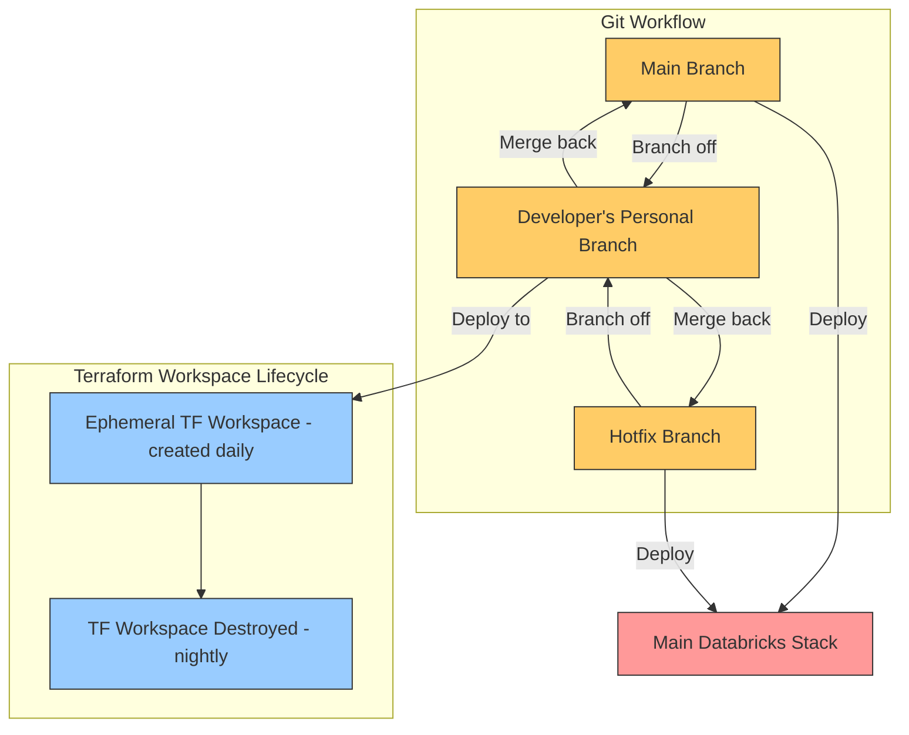

# Too Many Workspaces: Why We're Centralizing Databricks

We started with what felt like the right move: give each dev team their own Databricks stack — DEV, QA, UAT, and PROD. Isolated environments. Clean separation. Minimal cross-team interference.

But in reality, it turned into a mess.

We're now looking at over **30 workspaces**, each with its own permission model, diagnostic settings, and ACL sprawl. Just keeping track of who has access to what has become a job in itself.

Even our Databricks account manager called it out. Their other client? Just 10 workspaces total.

This isn’t sustainable — not with a lean DevOps team.

---

## The New Plan

We're consolidating to **a company-wide stack**: one workspace each for **DEV, QA, UAT, and PROD**.

Instead of isolating by environment, we’re separating by **data objects and permissions** inside a shared workspace — which, if you're familiar with Databricks, makes more sense. A workspace is just a container. It’s the permissions and structuring inside it that really determine access.

We're also rolling out **Databricks Asset Bundles (DAB)** across all teams. With DAB, teams can:

- Develop modular pipelines and notebooks
- Version and promote them cleanly through environments
- Deploy to the shared workspace without stepping on other teams

---

## How Teams Will Work

- **Personal Dev Workspaces (Ephemeral):**  
  Developers will spin up their own workspaces using Terraform in the morning. These are short-lived environments tied to feature branches.

- **Team Repo Branching:**  
  Developers branch from the main repo, deploy to their personal environment, and build/test in isolation.

- **Merge and Deploy:**  
  Once development is complete, changes are merged back into `main` or `hotfix`, and deployed to the central stack.

---

## Architecture: The New Flow

---

## Why This Works Better

- **Fewer things to manage:**  
  Fewer workspaces = fewer moving parts = fewer headaches.

- **Cleaner access control:**  
  One permission model. Enforced properly.

- **DAB makes isolation inside a workspace real:**  
  Bundles + good ACL hygiene = safe multi-team deployments.

- **Fast local dev cycles:**  
  Devs can still work independently, but we’re not managing 30+ different workspaces.

---

## The Tradeoffs

No architecture decision is perfect, and we’re not pretending this is a silver bullet.

- Shared workspaces require tighter governance.
- There’s more emphasis on permission boundaries within the workspace.
- Teams need to learn and adopt DAB — and structure their repos accordingly.

But overall? This scales. The old model doesn’t.